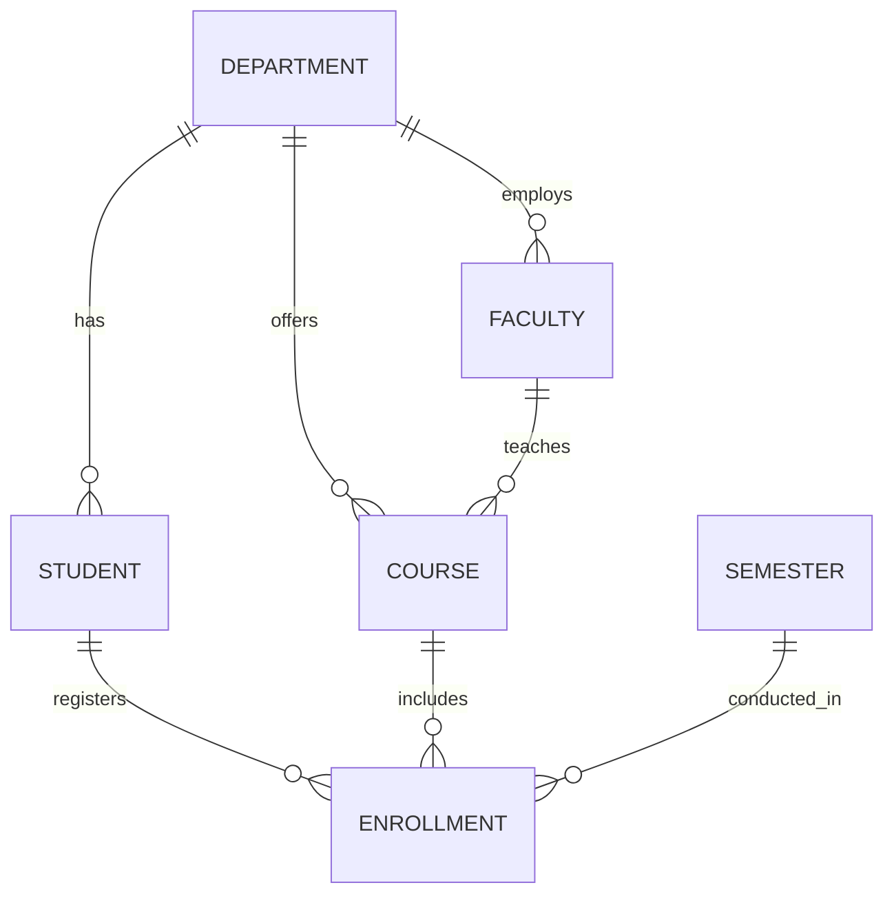

# Part 01: Database Design

## 🎯 Objective

Learn how to convert a real-world problem statement into a normalized relational database by performing requirement analysis, identifying entities and relationships, designing an ER diagram, and applying normalization up to Third Normal Form (3NF).

---

# 📚 Learning Outcomes

After completing this module, you will be able to:

- Analyze a real-world business problem.
- Identify entities, attributes, and relationships.
- Design an Entity Relationship (ER) Diagram.
- Apply database normalization up to 3NF.
- Prepare a normalized relational schema for implementation.

---

# 📝 Problem Statement

A university wants to develop a database system to manage academic activities efficiently.

The system should maintain information about:

- Departments
- Faculty Members
- Students
- Courses
- Semesters
- Student Enrollments
- Course Results

### Functional Requirements

- A department can have multiple faculty members.
- A department can have multiple students.
- A faculty member can teach multiple courses.
- A student can enroll in multiple courses.
- A course can have multiple enrolled students.
- Each enrollment belongs to one semester.
- Students receive marks and grades after completing a course.

---

# 🔍 Step 1: Requirement Analysis

The first step in database design is to identify the major entities involved in the system.

| Entity | Description |
|---------|-------------|
| Department | Academic department |
| Faculty | Faculty member teaching courses |
| Student | Student enrolled in the university |
| Course | Subject offered by a department |
| Semester | Academic semester |
| Enrollment | Student registration for a course |

---

# 🧩 Step 2: Identify Attributes

## Department

| Attribute | Description |
|-----------|-------------|
| department_id | Primary Key |
| department_name | Name of department |

---

## Faculty

| Attribute | Description |
|-----------|-------------|
| faculty_id | Primary Key |
| faculty_name | Faculty Name |
| email | Official Email |
| department_id | Foreign Key |

---

## Student

| Attribute | Description |
|-----------|-------------|
| student_id | Primary Key |
| first_name | Student First Name |
| last_name | Student Last Name |
| email | Email Address |
| phone | Contact Number |
| dob | Date of Birth |
| department_id | Foreign Key |

---

## Course

| Attribute | Description |
|-----------|-------------|
| course_id | Primary Key |
| course_name | Course Name |
| credits | Credit Value |
| faculty_id | Foreign Key |
| department_id | Foreign Key |

---

## Semester

| Attribute | Description |
|-----------|-------------|
| semester_id | Primary Key |
| semester_name | Semester Name |
| academic_year | Academic Year |

---

## Enrollment

| Attribute | Description |
|-----------|-------------|
| enrollment_id | Primary Key |
| student_id | Foreign Key |
| course_id | Foreign Key |
| semester_id | Foreign Key |
| marks | Marks Obtained |
| grade | Final Grade |

---

# 🔗 Step 3: Identify Relationships

| Relationship | Cardinality |
|--------------|-------------|
| Department → Student | One-to-Many |
| Department → Faculty | One-to-Many |
| Department → Course | One-to-Many |
| Faculty → Course | One-to-Many |
| Student → Enrollment | One-to-Many |
| Course → Enrollment | One-to-Many |
| Semester → Enrollment | One-to-Many |

---

# 📊 Step 4: Entity Relationship Diagram

---

# 🔄 Step 5: Database Normalization

Normalization is the process of organizing data to reduce redundancy and improve data integrity.

In this experiment, we will normalize the database up to **Third Normal Form (3NF)**.

---

## Unnormalized Form (UNF)

Consider the following student record.

| Student ID | Student Name | Courses | Marks |
|------------|--------------|---------|-------|
| S101 | Rahul | DBMS, SQL, Python | 90, 88, 92 |

### Problems

- Multiple values in a single column
- Difficult to search and update
- High data redundancy

---

## First Normal Form (1NF)

Rule:

- Each column should contain only atomic (single) values.
- Remove repeating groups.

| Student ID | Student Name | Course | Marks |
|------------|--------------|--------|-------|
| S101 | Rahul | DBMS | 90 |
| S101 | Rahul | SQL | 88 |
| S101 | Rahul | Python | 92 |

✅ Every cell contains a single value.

---

## Second Normal Form (2NF)

Rule:

- Must satisfy 1NF.
- Remove partial dependency.

Separate student information from course enrollment.

### Student

| Student ID | Name |
|------------|------|
| S101 | Rahul |

### Enrollment

| Student ID | Course | Marks |
|------------|--------|-------|
| S101 | DBMS | 90 |

✅ Student details are stored only once.

---

## Third Normal Form (3NF)

Rule:

- Must satisfy 2NF.
- Remove transitive dependency.

Instead of storing department information in the Student table:

| Student ID | Student Name | Department Name |
|------------|--------------|-----------------|
| S101 | Rahul | Computer Engineering |

Create a separate Department table.

### Department

| Department ID | Department Name |
|---------------|-----------------|
| D01 | Computer Engineering |

### Student

| Student ID | Student Name | Department ID |
|------------|--------------|---------------|
| S101 | Rahul | D01 |

✅ Department information is stored only once.

---

# ✅ Final Normalized Database

Our database consists of six normalized tables.

| Table | Purpose |
|--------|----------|
| Department | Department information |
| Faculty | Faculty details |
| Student | Student records |
| Course | Course information |
| Semester | Academic semester |
| Enrollment | Student course registration |

The database is fully normalized up to **Third Normal Form (3NF)**.

---

# 📌 Design Summary

| Step | Outcome |
|------|---------|
| Requirement Analysis | Business requirements identified |
| Entity Identification | Six entities finalized |
| Attribute Identification | Columns defined |
| Relationship Design | Entity relationships established |
| ER Diagram | Database blueprint created |
| Normalization | Database normalized up to 3NF |

---

# 🎯 Key Takeaways

- A well-designed database begins with a clear understanding of the problem.
- ER diagrams help visualize entities and their relationships.
- Normalization reduces redundancy and improves consistency.
- A normalized schema simplifies maintenance and improves data quality.
- The final schema is now ready for implementation in PostgreSQL.

---

# 💻 Practice Task

1. Draw the ER diagram using any ER modeling tool (e.g., Draw.io or dbdiagram.io).
2. Identify the primary and foreign keys for each table.
3. Explain why the Enrollment table acts as a bridge between Student and Course.
4. Verify that the database satisfies the rules of 1NF, 2NF, and 3NF.

---

# ➡️ Next Module

Continue with **02-PostgreSQL-Schema.md** to implement the normalized database in PostgreSQL using DDL statements, constraints, and modern SQL features.
